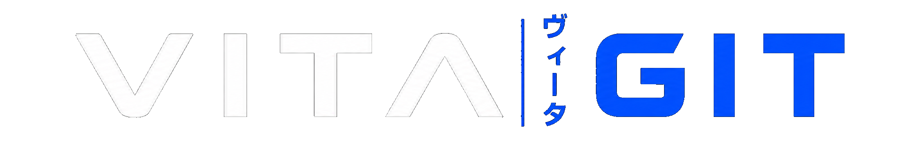

  

---

VitaGit is a web-based homebrew browser for the PlayStation Vita, designed to make finding and downloading applications as simple as possible.

VitaGit is built around GitHub repositories, allowing applications to be distributed directly from their developers' releases without relying on a centralized server.

## Website

The website is available at:

https://kiddrwxssj.github.io/vitagit.github.io/

## Database

VitaGit uses a separate database to index and organize the applications displayed on the website.

The database is maintained separately at [VitaGit Database](https://github.com/KiddRwxSsj/vitagit-db).

## Credits

The initial database was based on the [VitaDB](https://vitadb.rinnegatamante.it/) catalog through [NeoVitaDB-Catalog](https://github.com/robin994/NeoVitaDB-Catalog), with additional references from [VitaDBtoo-db](https://github.com/DrDecki/VitaDBtoo-db/tree/main), followed by restructuring and additional work for VitaGit.

* [NeoVitaDB-Catalog](https://github.com/robin994/NeoVitaDB-Catalog)
* [VitaDBtoo-db](https://github.com/DrDecki/VitaDBtoo-db)
* [VitaDB](https://vitadb.rinnegatamante.it/)

Homebrew applications, icons, metadata, and other assets remain the property of their respective authors.
